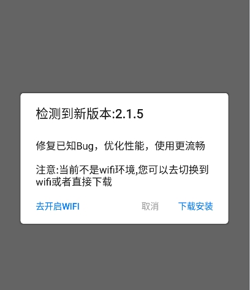

# ApkUpdater
[](https://jitpack.io/#hss01248/ApkUpdater)

based on HttpUtil和DialogUtil

封装apk更新的逻辑


# usage

## gradle

**Step 1.** Add the JitPack repository to your build file

Add it in your root build.gradle at the end of repositories:

```
    allprojects {
        repositories {
            ...
            maven { url "https://jitpack.io" }
        }
    }
```

**Step 2.** Add the dependency

```
    dependencies {
            compile 'com.github.hss01248:ApkUpdater:1.0.1'
    }
```


## 初始化-在application的oncreate方法中:

配置检查更新的url,以及json对应的javabean,并提供了一个接口,用于将用户javabean中的字段逐个拷贝到内部框架使用的bean.

```
ApkUpdater.getInstance()
                .init(this, "http://api.qxinli.com:9001/api/version/latestVersion/v1.json", UpdateModel.class,
                        new ApkUpdater.ObjectCopyable<UpdateModel>() {
                            @Override
                            public UpdateInfo copyValues(UpdateModel obj) {
                                if(obj.code !=0){
                                    Toast.makeText(getApplicationContext(),"不成功",Toast.LENGTH_SHORT).show();
                                    return null;
                                }
                                UpdateInfo info = new UpdateInfo();
                                info.versionName = obj.data.version;
                                info.versionCode = obj.data.code;
                                info.isForceUpdate = obj.data.forceUpdate==1;//服务器的强制更新配置
                                //info.isForceUpdate = true;
                                info.downloadUrl = obj.data.url;
                                info.dec = obj.data.description;
                                //info.apkSize = obj.data.size;
                                return info;
                            }
                        });
```

## 同时,添加生命周期callback(必须):

> 在onActivityResumed中调用ApkUpdater.onActivityResumed(activity);

```
registerActivityLifecycleCallbacks(new ActivityLifecycleCallbacks() {
    @Override
    public void onActivityCreated(Activity activity, Bundle savedInstanceState) {

    }

    @Override
    public void onActivityStarted(Activity activity) {

    }

    @Override
    public void onActivityResumed(Activity activity) {
        ApkUpdater.onActivityResumed(activity);

    }

    @Override
    public void onActivityPaused(Activity activity) {

    }

    @Override
    public void onActivityStopped(Activity activity) {

    }

    @Override
    public void onActivitySaveInstanceState(Activity activity, Bundle outState) {

    }

    @Override
    public void onActivityDestroyed(Activity activity) {

    }
});
```


## 手动点击"检查更新"

> 不要在activity的onstart中调用,不要在application的oncreate中调用

```
ApkUpdater.getInstance().update(false);
```

检测更新信息时弹出"loading"对话框

检查到有更新时:

弹出更新的信息对话框,选择是否更新.如果不是wifi,有相关提示信息

弹出进度对话框显示下载进度

下载完成后弹出apk安装界面

## 进入首页时"偷偷"拉取更新信息

```
ApkUpdater.getInstance().update(true);
```

静默检测更新信息.

检查到有更新时:

如果不是wifi,不下载.

如果是wifi,如果服务器没有要求强制更新,则弹出对话框,让用户选择是否更新,后续同上面手动点击.

如果服务器要求强制更新,则"偷偷"下载,下载完后直接弹出apk安装界面.


# UI

> 下图按钮颜色暂时写死成ios蓝

 

> 下图颜色由colorAccent决定,可自行配置

  